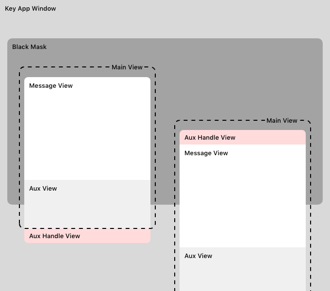
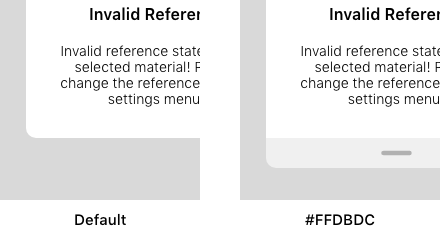

# TDNotificationView
## A Custom Notification/Alert View for iOS
[](https://github.com/babaksamareh/TD-DecimalKeyboard/blob/master/LICENSE)  


## About
**TDNotificationView** is a custom notification and alert view for iOS devices. It is highly customizable and can be used as an alternative to the native iOS alerting system. TDNotificationView can also be configured to show an optional auxiliary view when more information or guidance is required. In this case, the auxiliary view can be swiped open to show an array of scrollable sub-views to walk the user through steps required to solve the issue. When not needed anymore, it can be easily swiped close.  

This project is developed and maintained by **touchDev**.

## Installation
Just add `TDNotificationView.h`, `TDNotificationView.m`, and image assets to your project. To add the class to a view controller, make sure class header is added to the view's header file and the instance is locally defined, e.g., if your main view is called ViewController, add the following lines to `ViewController.h`:

``` objective-c
#import "TDNotificationView.h"

@interface ViewController : UIViewController
{
    // Notification view instance
    TDNotificationView *tdNotificationView;
}
```

## Initialization
Initialize TDNotificationView's instance whenever you want to show the notification or alert view. You can optionally configure the instance using public properties.

``` objective-c
- (void)showSomeNotification
{
    // Initialize the notification view
    tdNotificationView = [[TDNotificationView alloc] init];
    
    // Configure the notification view
    // << CONFIGURE >>
}
```

## View Hierarchy


## Usage
TDNotificationView can be presented in two forms: **_Notification_** or **_Alert_**.


### Notification
Once TDNotificationView is initialized and configured, notification view can be presented by using the `showNotificationWithTitle` method. In `showSomeNotification` add the following line:
``` Objective-c
[tdNotificationView showNotificationWithTitle:titleString andMessage:messageString];
```
with `(NSString *)titleString` being the title and `(NSString *)messageString` being the message to be shown. 

### Alert
Alerts can be presented in a similar fashion. In `showSomeNotification` add the following line:
``` Objective-c
[tdNotificationView showAlertWithTitle:titleString andMessage:messageString];
```
with `(NSString *)titleString` being the title and `(NSString *)messageString` being the message to be shown. 

## Configuration
TDNotificationView can be configured<sup>1</sup> using the following public properties.

|Name|Default|Sample|
|------|-----|:----:|
|`UIColor`<br>**mainBackgroundColor**|whiteColor||
|`UIColor`<br>**auxHandleTint**|90% whiteColor<sup>2</sup>||
|`UIColor`<br>**handleLineTint**|greyColor||
|`UIColor`<br>**auxViewTint**|90% whiteColor||
|`UIFont`<br>**titleFont**|Semibold system font 16pt||
|`UIFont`<br>**messageFont**|Light system font 14pt||
|`BOOL`<br>**enableAuxView**|NO||
|`UIViewAnimationOptions`<br>**animationOption**|EaseOut||
|`NVAnimationStyle`<br>**animationStyle**|NVExpandAndCenter||
|`BOOL`<br>**enableHandleAnimation**|NO||
|`NSArray`<br>**auxViewsArray**|nil||
|`UIViewContentMode`<br>**auxViewContentMode**|Center||

<sup>1</sup> Configuration properties must be set before presenting the view.<br>
<sup>2</sup> You can also use a transparent handle color and other views will be adjusted automatically.


## Follow us for the latest updates
<a href="https://github.com/touchDev" >
</a>
